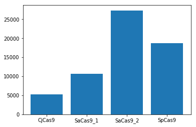
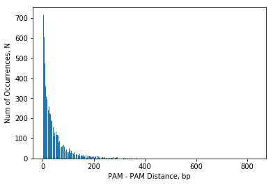

```python
from Bio import Entrez
import re
Entrez.email = 'sasha.grrshnova98@gmail.com'
```


```python
#retrieve sequence by id from ncbi genbank

def id_search(seq_id):
    handle = Entrez.efetch(db="nucleotide", id=seq_id, rettype="fasta")
    genome = handle.read()
    genome = genome.split('\n')
    genome = " ".join(genome[1:])
    genome = genome.replace(" ",'')
    return genome
```


```python
#print(id_search('NC_001318.1'))
```


```python
#retrieve PAM positions in genome/gene by id of the sequence from ncbi genbank

def PAM_search(seq_id):
    handle = Entrez.efetch(db="nucleotide", id=seq_id, rettype="fasta")
    genome = handle.read()
    genome = genome.split('\n')
    genome = " ".join(genome[1:])
    
    PAM_positions = {}
    PAM_count = {}

    PAM_pos = []
    for m in re.finditer(r"[ACGT]GG", genome):
        PAM_pos.append(m.start())
        PAM_positions['SpCas9'] = PAM_pos
        PAM_count['SpCas9'] = len(PAM_pos)
    
    PAM_pos = []
    for m in re.finditer(r"[ACGT]G[AG][AG]T", genome):
        PAM_pos.append(m.start())
        PAM_positions['SaCas9_1'] = PAM_pos
        PAM_count['SaCas9_1'] = len(PAM_pos)

    PAM_pos = []
    for m in re.finditer(r"[ACGT]G[AG][AG][ACGT]", genome):
        PAM_pos.append(m.start())
        PAM_positions['SaCas9_2'] = PAM_pos
        PAM_count['SaCas9_2'] = len(PAM_pos)
    
    PAM_pos = []
    for m in re.finditer(r"[ACGT][ACGT][ACGT][ACGT][AG][CT]AC", genome):
        PAM_pos.append(m.start())
        PAM_positions['CjCas9'] = PAM_pos
        PAM_count['CjCas9'] = len(PAM_pos)

    return PAM_positions
```


```python
#PAM positions in B.burgdorferi genome

Bburgdorferi_PAM = PAM_search('NC_001318.1')
```


```python
#number of PAM for different Cas9 proteins in B.burgdorferi genome

Bburgdorferi_PAM_cnt = {}
for k in Bburgdorferi_PAM.keys():
    Bburgdorferi_PAM_cnt[k] = len(Bburgdorferi_PAM.get(k))
    
print(Bburgdorferi_PAM_cnt)
```

    {'SpCas9': 18744, 'SaCas9_1': 10657, 'SaCas9_2': 27313, 'CjCas9': 5229}
    


```python
#histogram - number of PAM for different Cas9 proteins in B.burgdorferi genome

import matplotlib.pyplot as plt

plt.bar(list(Bburgdorferi_PAM_cnt.keys()), Bburgdorferi_PAM_cnt.values())
plt.show()
```





```python
#number of PAM pairs with distance between PAM 24 bp

SpCas9_PAM_start = Bburgdorferi_PAM['SpCas9']

SpCas9_PAM_dist_24 = []
for i in range(len(SpCas9_PAM_start)-1):
    if SpCas9_PAM_start[i+1] - SpCas9_PAM_start[i] == 24:
        SpCas9_PAM_dist_24.append(SpCas9_PAM_start[i])

print(len(SpCas9_PAM_dist_24))
```

    251
    


```python
#distance between PAM pairs in B.burgdorferi genome

SpCas9_PAM_dist = []
for i in range(len(SpCas9_PAM_start)-1):
    SpCas9_PAM_dist.append(SpCas9_PAM_start[i+1]-SpCas9_PAM_start[i])

SpCas9_PAM_distance_count = {}

SpCas9_PAM_pairs_distance_val = list(set(SpCas9_PAM_dist))

for v in SpCas9_PAM_pairs_distance_val:
    distance, num = v, SpCas9_PAM_dist.count(v)
    SpCas9_PAM_distance_count[distance] = num

plt.bar(list(SpCas9_PAM_distance_count.keys()), SpCas9_PAM_distance_count.values())

plt.xlabel('PAM - PAM Distance, bp')
plt.ylabel('Num of Occurrences, N')

plt.show()
```





```python
def id_search_gb(seq_id):
    handle = Entrez.efetch(db="nucleotide", id=seq_id, rettype="gb", retmode="text")
    genome = handle.read()
    return genome

#print(id_search_gb('NC_001318'))
```


```python
Bburgdorferi_genome_gb = id_search_gb('NC_001318')
```


```python
#gene ids from gb sequence file by genome id

def gene_ids(genome_id):
    genome = id_search_gb(genome_id)
    gene_ids = []
    for m in re.finditer(r"GeneID:[0-9]+", genome):
        gene_id = genome[m.start():m.end()]
        gene_ids.append(gene_id[7:])
    return gene_ids
```


```python
#print(gene_ids('NC_001318'))
```


```python
#reverse complement strand

from Bio.Seq import Seq
from Bio.Alphabet import generic_dna

genome = id_search('NC_001318.1')
Watson_strand = Seq(genome)
Watson_strand = str(Watson_strand).replace(" ",'')
Crick_strand = Seq(Watson_strand).reverse_complement().lstrip()[::-1]
```


```python
def PAM_rev_search(seq_id):
    handle = Entrez.efetch(db="nucleotide", id=seq_id, rettype="fasta")
    genome = handle.read()
    genome = genome.split('\n')
    genome = " ".join(genome[1:])
    genome = genome.replace(" ",'')

    W_strand = Seq(genome)
    W_strand = str(W_strand).replace(" ",'')
    C_strand = Seq(W_strand).reverse_complement().lstrip()[::-1]
    C_strand = str(C_strand)

    PAM_positions = {}
    PAM_count = {}

    PAM_pos = []
    for m in re.finditer(r"GG[ACGT]", C_strand):
        PAM_pos.append(m.start())
        PAM_positions['SpCas9'] = PAM_pos
        PAM_count['SpCas9'] = len(PAM_pos)
    
    return PAM_positions
```


```python
id = 'NC_001318.1'
PAM_rev_pos = PAM_rev_search(id)
PAM_pos = PAM_search(id)
```


```python
PAM_SpCas9_pos = PAM_pos["SpCas9"]
PAM_SpCas9_rev_pos = PAM_rev_pos["SpCas9"]
```


```python
#print(PAM_SpCas9_rev_pos)
```


```python
print(len(PAM_SpCas9_pos))
print(len(PAM_SpCas9_rev_pos))
```

    18744
    19496
    


```python
PAM_SpCas9_pos = PAM_SpCas9_pos[:1000]
PAM_SpCas9_rev_pos = PAM_SpCas9_rev_pos[:1000]
```


```python
PAM_pairs_distance = {'PAM_SpCas9_rev_pos' : PAM_SpCas9_rev_pos}

for el in PAM_SpCas9_pos:
    PAM_pairs_distance[el] = []
    for e in PAM_SpCas9_rev_pos:
        PAM_pairs_distance[el].append(abs(el-e))
```


```python
#print(PAM_pairs_distance)
```


```python
f = open("PAM_pairs_distance.txt", "a")
for k in PAM_pairs_distance.keys():
    a = str(k)+' '+str(PAM_pairs_distance[k])+'\n'
    f.write(a)
f.close()
```


```python
with open("PAM_pairs_distance.txt", 'r') as fin:
    print(fin.read())
```

    IOPub data rate exceeded.
    The notebook server will temporarily stop sending output
    to the client in order to avoid crashing it.
    To change this limit, set the config variable
    `--NotebookApp.iopub_data_rate_limit`.
    


```python
import pandas as pd
df = pd.DataFrame(PAM_pairs_distance)
```


```python
#PAM_SpCas9_pos : PAM_SpCas9_rev_pos 

positions = {}

for col in df.columns:
    Index_label = df[df[col] == 24].index.tolist()
    if len(Index_label) != 0:
        for el in Index_label:
            positions[col] = df.iat[el,0]
    
print(positions)
```

    {715: 739, 3879: 3903, 4692: 4716, 6213: 6237, 6771: 6795, 7463: 7487, 8222: 8198, 11481: 11457, 13220: 13196, 13419: 13443, 17870: 17894, 18800: 18824, 21283: 21259, 21911: 21935, 23645: 23621, 24259: 24283, 24434: 24458, 25173: 25197, 25319: 25295, 27735: 27711, 28027: 28051, 29429: 29453, 30968: 30944, 31639: 31663, 34090: 34066, 34175: 34199, 34181: 34205, 34281: 34305, 38101: 38077, 39061: 39037}
    


```python
f = open("PAM_24_SpCas9.txt", "a")
for k in positions.keys():
    a = str(k)+' '+str(positions[k])+'\n'
    f.write(a)
f.close()
```


```python
with open("PAM_24_SpCas9.txt", 'r') as fin:
    print(fin.read())
```

    715 739
    3879 3903
    4692 4716
    6213 6237
    6771 6795
    7463 7487
    8222 8198
    11481 11457
    13220 13196
    13419 13443
    17870 17894
    18800 18824
    21283 21259
    21911 21935
    23645 23621
    24259 24283
    24434 24458
    25173 25197
    25319 25295
    27735 27711
    28027 28051
    29429 29453
    30968 30944
    31639 31663
    34090 34066
    34175 34199
    34181 34205
    34281 34305
    38101 38077
    39061 39037
    715 739
    3879 3903
    4692 4716
    6213 6237
    6771 6795
    7463 7487
    8222 8198
    11481 11457
    13220 13196
    13419 13443
    17870 17894
    18800 18824
    21283 21259
    21911 21935
    23645 23621
    24259 24283
    24434 24458
    25173 25197
    25319 25295
    27735 27711
    28027 28051
    29429 29453
    30968 30944
    31639 31663
    34090 34066
    34175 34199
    34181 34205
    34281 34305
    38101 38077
    39061 39037
    
    


```python
PAM_SpCas9_pos = PAM_SpCas9_pos[500:1000]
PAM_SpCas9_rev_pos = PAM_SpCas9_rev_pos[500:1000]

PAM_pairs_distance = {'PAM_SpCas9_rev_pos' : PAM_SpCas9_rev_pos}

for el in PAM_SpCas9_pos:
    PAM_pairs_distance[el] = []
    for e in PAM_SpCas9_rev_pos:
        PAM_pairs_distance[el].append(abs(el-e))

df = pd.DataFrame(PAM_pairs_distance)

positions2 = {}

for col in df.columns:
    Index_label = df[df[col] == 24].index.tolist()
    if len(Index_label) != 0:
        positions2[col] = Index_label

for k in positions2.keys():
    Index_label2 = []
    for el in positions2[k]:
        Index_label2.append(el + 500)
    positions2[k] = Index_label2
    
print(positions2)
```

    {}
    
